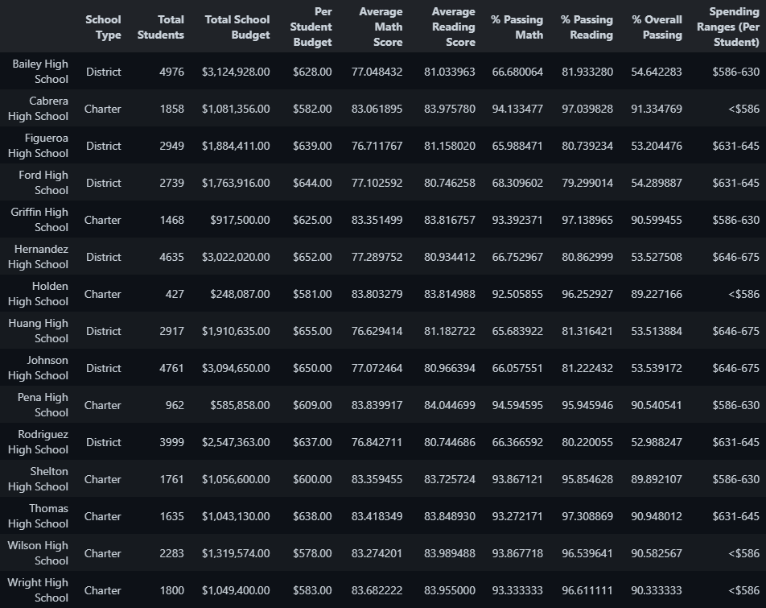
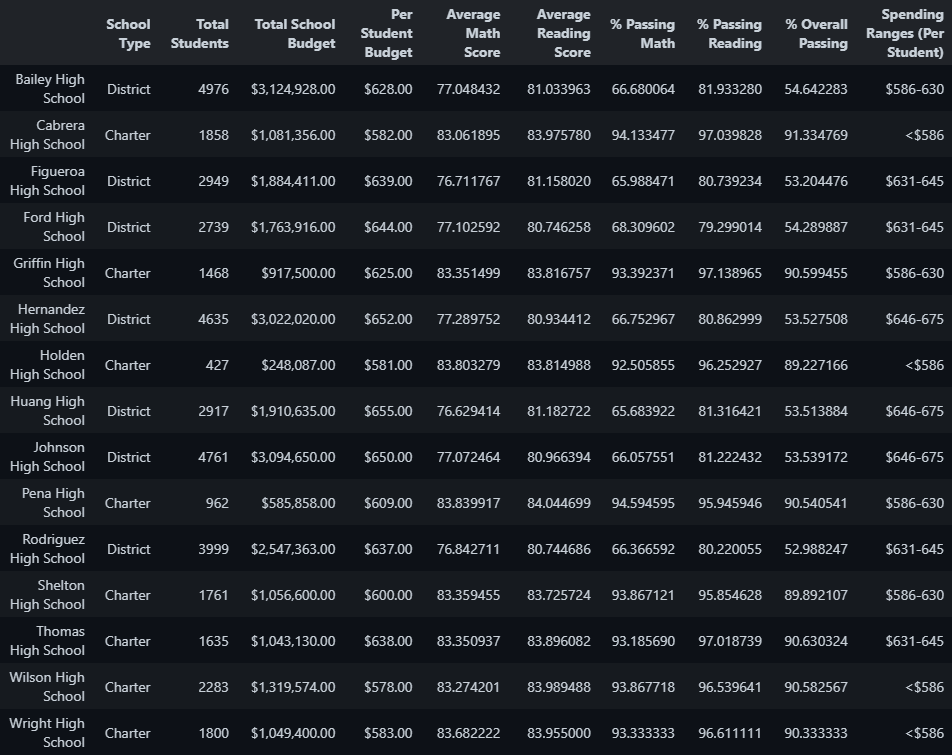

# School District Analysis

## Overview
Do this last.

## Results

Replacing the ninth-grade scores of students at Thomas High School had the following effects:

### District Summary

#### Before:

#### After:

There was little (0.1 points) to no change for average scores in each subject, and a 0.3 p.p. decrease in overall passing rate. These changes appear negligible.

### School Summary

### Before:

### After:

The average math score for Thomas High School decreased by about 0.06 points, with the average reading score increasing by about the same amount. There was a decrease in overall passing by about 0.31 p.p., to 90.63%. The changes at the school level seem yet negligible.

### Relative Ranking

Score replacement did not affect Thomas High School's second-place rank in overall passing rate.

### Math and Reading Scores by Grade

As intended, only the scores for 9th graders at Thomas High School were altered, being replaced by NaN for both subjects.

### Scores by School Spending

There was no change in the reported values for scores grouped by per-student spending in Thomas High School's cohort ($631-645).

### Scores by School Size

There was no change in the reported values for scores grouped by school size in Thomas High School's cohort (1000-1999).

### Scores by School Type

There was no change in the reported values for scores grouped by school type in Thomas High School's cohort (Charter).

## Summary

Summarize four changes in the updated school district analysis after reading and math scores for the ninth grade at Thomas High School have been replaced with NaNs.